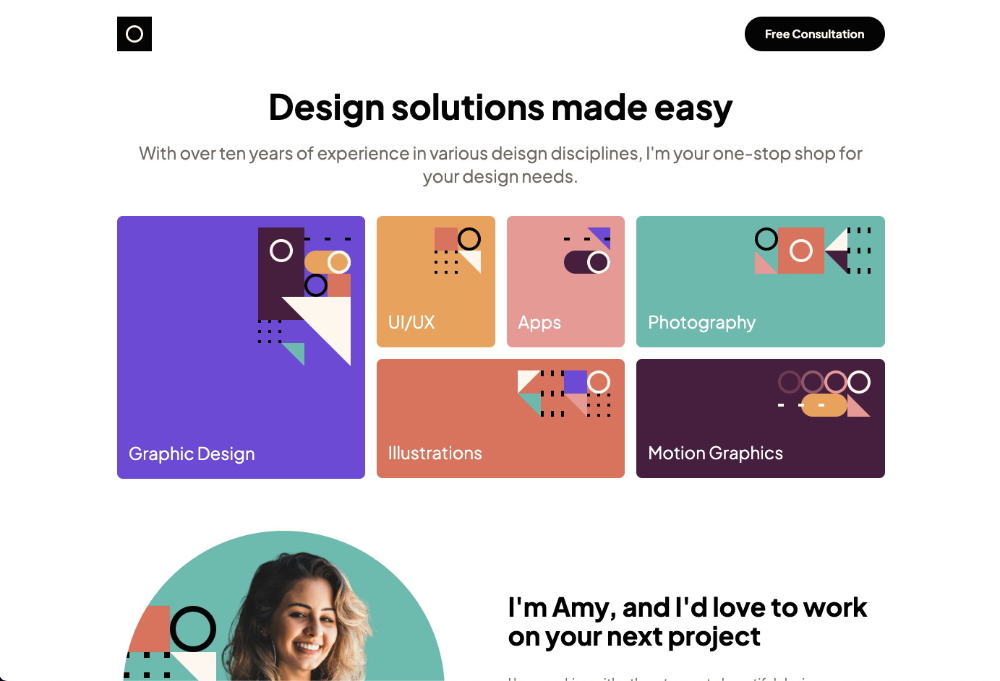
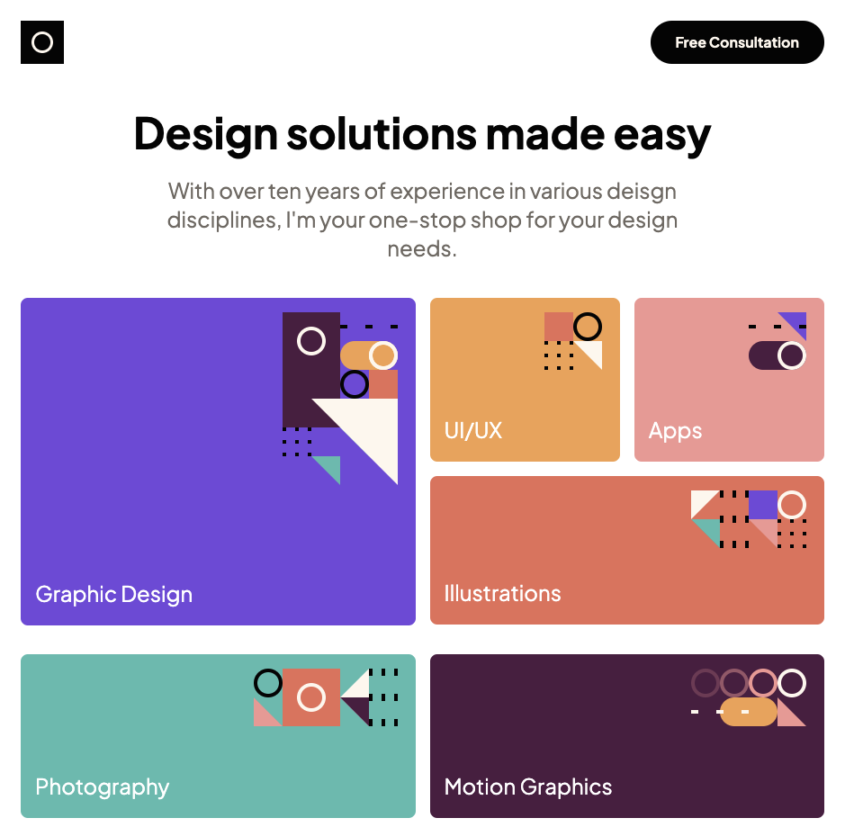

# Frontend Mentor - Single-page design portfolio

## Table of contents

- [Overview](#overview)
  - [The challenge](#the-challenge)
  - [Screenshot](#screenshot)
  - [Links](#links)
- [My process](#my-process)
  - [Built with](#built-with)
  - [What I learned](#what-i-learned)
- [Author](#author)

## Overview

### The challenge

Users should be able to:

- View the optimal layout depending on their device's screen size
- Click through the carousel under the Work Section

### Screenshot

### Links

- Solution URL: [View Github Code](https://github.com/jchapar/design_portfolio_FEM)
- Live Site URL: [Visit Site](https://jchapar.github.io/github_FEM/)

## My process

### Built with

- Semantic HTML5 markup
- CSS custom properties
- Tailwind CSS
- Flexbox
- Mobile-first workflow
- Figma - For design files
- Vanilla JavaScript

### What I learned

- Continued practice with TailwindCSS and customizing classes.
- JavaScript functionality added for the carousel.

## Author

- Frontend Mentor - [@jchapar](https://www.frontendmentor.io/profile/jchapar)
- Twitter - [@j_chapar](https://www.twitter.com/j_chapar)
